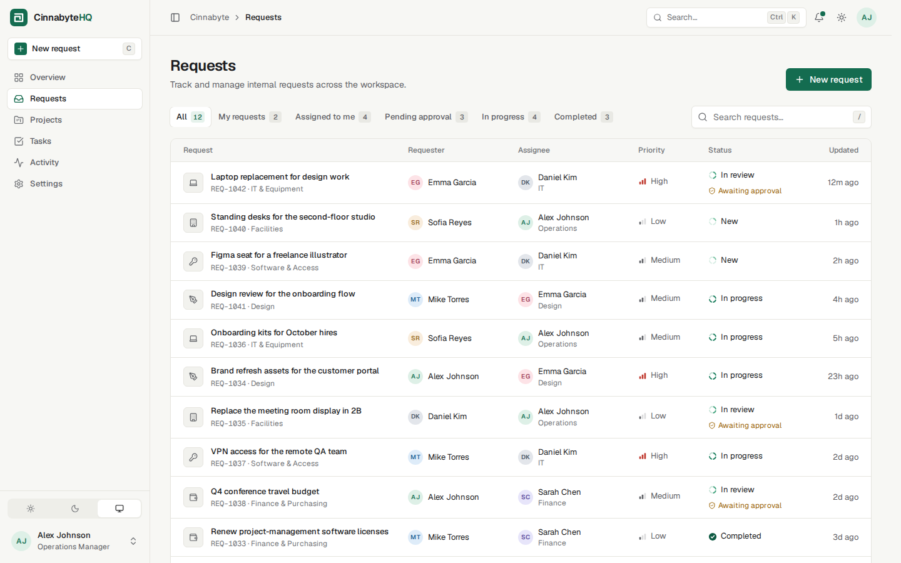

# CinnabyteHQ

**One place for a small team's internal operations** — requests, approvals, projects, tasks and a live activity log.

CinnabyteHQ is a portfolio project built with **Astro, TypeScript and Tailwind CSS**. The frontend is complete, and the data layer is a mock whose architecture is ready to be swapped for a REST API backed by PostgreSQL without touching the UI.


| Dark mode | Request workflow |
| --- | --- |
|  |  |
| **Requests** | **Phone** |
|  |  |

---

## What's inside

| Area | What you can do |
| --- | --- |
| **Overview** | Greeting, four KPI tiles, the request pipeline (part-to-whole bar), requests that need attention, recent activity, your tasks and project progress. Each section streams in behind a skeleton (Astro server islands). |
| **Requests** | Six saved views (All, My requests, Assigned to me, Pending approval, In progress, Completed) with live counts, instant search, and a table that becomes cards on phones. |
| **Request detail** | Workflow stepper, a **Next step** card that says what has to happen next (and lets you do it), status and assignee menus, approval card, comment thread, copy link and delete (with confirmation). |
| **New request** | Modal form with inline validation, a character counter, and a hint when the category needs approval. It can be opened from anywhere with `C`. |
| **Projects** | Cards with progress, status, owner, task count and due date. Each project has a detail page with its tasks, people and recent activity. |
| **Tasks** | Complete tasks with a checkbox, change status from a menu, expand a task for its details, and filter or search the list. Updates are optimistic, so the row changes instantly. |
| **Activity** | Chronological audit log grouped by day, filterable by requests, projects or tasks. |
| **Settings** | Profile (saved through the service layer), appearance (Light / Dark / System with live previews), notification preferences and workspace name. |
| **Everywhere** | ⌘K / Ctrl+K command palette with live search, notifications panel with unread state, toasts, keyboard shortcuts, a collapsible sidebar, and a mobile drawer. |

### Workflow rules

Requests move through **New → In review → In progress → Completed**.

- Requests in **IT & Equipment**, **Facilities** and **Finance & Purchasing** need an approval. Moving one to *In review* routes it automatically: Facilities goes to Operations, spend goes to Finance, and a request is never routed to its own requester.
- A request can't start or complete until its approval is granted. The status menu disables those options and the service enforces the same rule.
- Approving a request moves it to *In progress*.
- Every change is written to the activity log and shows up in the request's timeline, the Activity page, notifications and the dashboard.

---

## Getting started

Requires **Node.js 22.12+**.

```bash
npm install
npm run dev        # http://localhost:4321  (opens on the Overview)
```

| Script | Does |
| --- | --- |
| `npm run dev` | Development server with hot reload |
| `npm run build` | Production build (`dist/`) |
| `npm start` | Runs the production build (`node ./dist/server/entry.mjs`) |
| `npm run preview` | Previews the production build through Astro |
| `npm run check` | Type-checks `.astro` and `.ts` files |

Optional: copy `.env.example` to `.env`. Setting `MOCK_LATENCY=off` removes the simulated network delay.

> The demo user is **Alex Johnson (Operations Manager)**. Alex approves Facilities requests, so REQ-1035 is waiting on you.

---

## Architecture

```
 Browser                          Astro server (Node)
 ───────                          ───────────────────
 pages & components  ── render ──►  pages/*.astro ─┐
                                                   ├──►  services/*.ts  ──►  data/store.ts (mock, in memory)
 client scripts      ── actions ─►  actions/*.ts ──┘         │
                                                             └─ Phase 2 ──►  REST API  ──►  PostgreSQL
```

- **Pages render on the server** and read data only through **`src/services`**.
- **Mutations** (create a request, approve it, complete a task…) go through **Astro Actions** (`src/actions`). They validate input with Zod and then call the same services.
- **Services are the only code that knows where data lives.** Today they read and write an in-memory mock store. In Phase 2 each function body becomes a call to the REST API. Signatures and return types stay the same, so no component or page changes.
- **Middleware** resolves the signed-in user and the viewer's time zone. Authentication will plug in there.

The full migration guide, including endpoint mapping, the SQL schema and the auth plan, is in **[docs/BACKEND_INTEGRATION.md](docs/BACKEND_INTEGRATION.md)**.

### Folder structure

```
src/
├── actions/index.ts        Mutation boundary (Zod-validated) → services
├── components/
│   ├── ui/                 Design-system primitives: Button, Card, Menu, Dialog, Field, Tabs,
│   │                       EmptyState, ErrorState, Skeleton, ProgressBar, PipelineIcon…
│   ├── layout/             Sidebar, Topbar, command palette, notifications, toasts, theme controls
│   ├── dashboard/          Overview sections (server islands) + skeletons
│   ├── requests/           Table, status/priority labels, workflow stepper, next step, timeline, form
│   ├── projects/           Project card, status badge
│   ├── tasks/              Task row (full + compact), status label
│   ├── activity/           Activity sentence, detail, item and day-grouped timeline
│   └── settings/           Settings section, theme preview
├── data/
│   ├── mockUsers.ts        6 people
│   ├── mockRequests.ts     12 requests + 6 approvals
│   ├── mockProjects.ts     6 projects
│   ├── mockTasks.ts        15 tasks
│   ├── mockActivity.ts     25 activity events
│   ├── store.ts            In-memory "database" seeded from the files above
│   └── time.ts             Seed timestamps relative to server start
├── layouts/                BaseLayout (document, theme pre-paint) and AppLayout (app shell)
├── lib/
│   ├── utils.ts            cn(), search matching, formatting helpers
│   ├── dates.ts            Relative times, day grouping, due dates, greetings (time-zone aware)
│   └── meta.ts             Labels and ordering for every status, priority, category and view
├── pages/                  index (→ /dashboard), dashboard, requests, projects, tasks, activity,
│                           settings, 404
├── scripts/                Small client-side modules (theme, popovers, dialogs, palette, toasts,
│                           shortcuts, task and request interactions…)
├── services/               requests, projects, tasks, users, activity, dashboard, search,
│                           errors, http (Phase 2 REST client)
├── styles/global.css       Design tokens, light/dark themes, Tailwind setup
├── types/index.ts          Domain model: User, Request, Approval, Project, Task, Activity
└── middleware.ts           Current user + time zone (auth goes here)
```

### How the mock data works

1. `src/data/mock*.ts` hold realistic seed data. The dashboard counts, request timelines, project task counts and notifications are all derived from these records, so they stay consistent.
2. On server start, `src/data/store.ts` clones the seed into an in-memory store. It lives on `globalThis`, so dev hot reloads don't wipe it. Each request's `updatedAt` is recalculated from its latest activity event.
3. Seed timestamps are relative to server start (`ago({ hours: 2 })`, `dueIn(1)`), so the workspace always looks current.
4. Services read and write the store. Every call waits a short, random delay to simulate a network round trip, so loading states are exercised. Writes also record activity events, just as the future API will.
5. Changes last until the server restarts. Restart the server to reset the demo.

> Because state lives in the server process, deploy the demo to a single Node process (Render, Railway, Fly.io or a VPS). On serverless platforms each instance would have its own copy.

---

## Design system

- **Tokens, not hex values.** Every color is a CSS variable in `src/styles/global.css` (canvas → surface → elevated → subtle layers, text tiers, borders, accent and semantic states), exposed as Tailwind utilities such as `bg-surface`, `text-fg-muted` and `border-line`. Dark mode redefines the same tokens; components contain no theme-specific colors.
- **Cinnabyte emerald** is the single accent. The request pipeline uses a validated one-hue ordinal ramp: later stages are darker in light mode and brighter in dark mode.
- **Status is never color-only.** Request and task statuses use a segmented ring glyph whose filled segments show progress through the workflow, always next to a text label. Priority uses bar glyphs plus a label.
- **Themes:** Light, Dark or System, stored in `localStorage`. An inline script applies the theme before first paint, so there is no flash of the wrong theme. Theme controls in the sidebar, top bar and settings stay in sync, and the theme also syncs across tabs.
- **Type:** Geist and Geist Mono (for IDs), self-hosted via Fontsource.
- **Motion:** 150–250 ms transitions, used only for feedback (menus, dialogs, toasts, island content fade-in). `prefers-reduced-motion` is respected.
- **Logo:** a squared spiral, read as a cinnamon roll drawn on a pixel grid, or a workflow that loops inward to one point of focus.

### Responsive behaviour

| Width | Layout |
| --- | --- |
| ≥ 1280px | Full sidebar, collapsible to an icon rail (`[` or the top-bar button); the choice is remembered |
| 768–1279px | Icon rail with tooltips |
| < 768px | Navigation drawer; tables become cards; stacked layouts; bottom-sheet dialogs; larger touch targets |

### Accessibility

Semantic landmarks and headings, a skip link, labelled form controls with `aria-invalid` and linked error messages, native `<dialog>` (focus trap and Escape) and the native Popover API (light dismiss) with arrow-key menu navigation. Also: visible focus rings, `aria-current` on navigation and tabs, a combobox/listbox pattern in the command palette, polite live regions for toasts, and WCAG AA text contrast in both themes.

### Keyboard shortcuts

| Keys | Action |
| --- | --- |
| `⌘K` / `Ctrl K` | Command palette (search + actions) |
| `C` | New request |
| `/` | Focus the list search (or open the palette) |
| `G` then `D` `R` `P` `T` `A` `S` | Go to Overview, Requests, Projects, Tasks, Activity, Settings |
| `[` | Collapse / expand the sidebar |
| `?` | Show all shortcuts |

---

## Phase 2 roadmap

1. **REST API + PostgreSQL.** Stand up the API from the schema in `docs/BACKEND_INTEGRATION.md`, then switch each service to `api.*` calls, one file at a time.
2. **Authentication.** Sign-in, sessions in `middleware.ts`, a real `getCurrentUser()`, and removal of the demo user.
3. **Move workflow rules server-side.** Approval routing, the approval gate and activity logging become API logic inside transactions.
4. **Roles and permissions.** Keep them simple: admins manage members and settings, approvers approve, everyone else requests.
5. **Notification delivery.** Persist read state and preferences, and send email digests.
6. **Create and edit** tasks and projects, with attachments on requests.
7. **Tests.** Unit tests for services and lib, plus Playwright end-to-end tests for the main flows (create → approve → complete).

---

Built as a portfolio project. The names, people and data are fictional.
