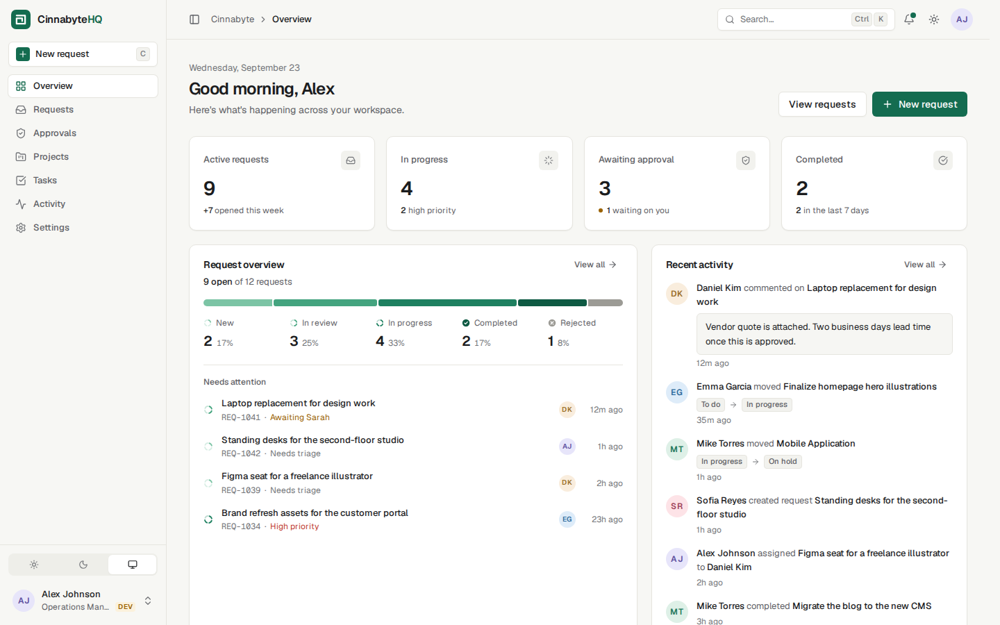
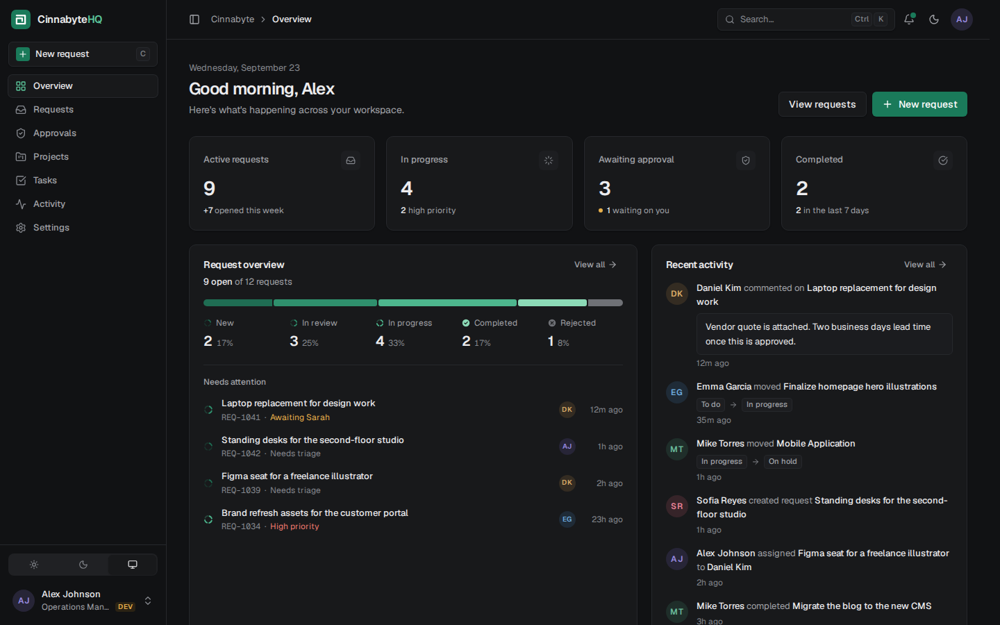
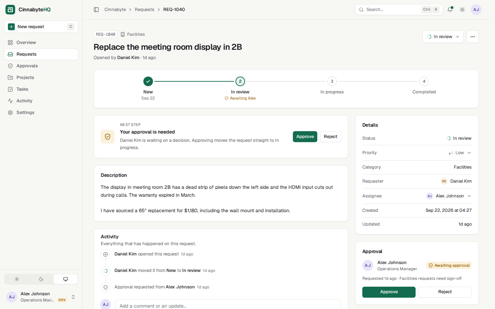
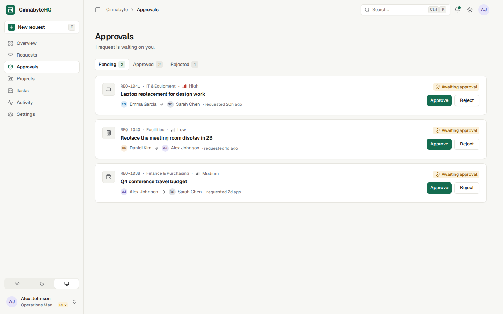
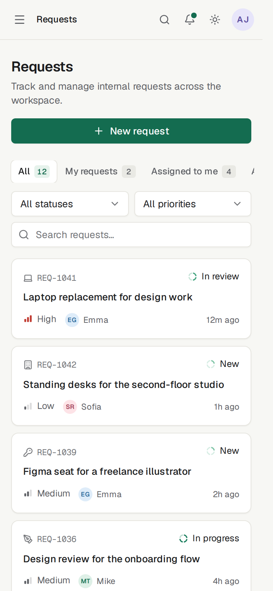

# CinnabyteHQ

**One place for a small team's internal operations**: requests, approvals, projects, tasks and a live activity log.

CinnabyteHQ is a full-stack portfolio project. An **Astro** frontend talks to its own **REST API**, which reads and writes **PostgreSQL** through **Supabase**. Every number on the dashboard, every status change and every activity entry comes from the database.



| Dark mode | Request workflow |
| --- | --- |
|  |  |
| **Approvals** | **Phone** |
|  |  |

> **Development build: there is no sign-in yet.** Every request acts as one development user (`DEV_USER_EMAIL`, by default the seeded admin *Alex Johnson*). This is clearly marked in the UI, and it is **not security**: don't deploy this build publicly. See [Authentication](#authentication).

---

## Contents

- [Description](#description)
- [Tech stack](#tech-stack)
- [Architecture](#architecture)
- [Project structure](#project-structure)
- [Supabase setup](#supabase-setup)
- [Environment variables](#environment-variables)
- [Database setup: migrations and seed](#database-setup)
- [How to run locally](#how-to-run-locally)
- [API overview](#api-overview)
- [Authentication](#authentication)
- [Design system](#design-system)
- [Future improvements](#future-improvements)

---

## Description

| Area | What you can do |
| --- | --- |
| **Overview** | KPI tiles (active requests, in progress, awaiting approval, completed), the request pipeline, requests that need attention, recent activity, your tasks and project progress. Each section is a server island that fetches from the API behind a skeleton. |
| **Requests** | Views (All, My requests, Assigned to me, Awaiting approval) with live counts, status and priority filters, and debounced search. Filters are kept in the URL. The list is fetched from `GET /api/requests`, and has loading, empty, no-results and error states. A new request appears at the top as soon as it's created. |
| **Request detail** | Workflow stepper, a **Next step** card, status, priority and assignee menus, the approval card (approve or reject with a reason), a timeline built from the activity log, comments, copy link and delete. |
| **Approvals** | Pending, approved and rejected tabs with counts. Approve or reject in place. |
| **Projects** | Cards with progress, status and task counts. You can create, edit and delete projects. Each project has a page with its tasks, people and history. |
| **Tasks** | Complete a task with its checkbox, and change its status or assignee from menus. The row updates straight away and rolls back if the save fails. You can also filter, search, create and delete tasks. |
| **Activity** | The audit log, grouped by day and filterable by requests, projects or tasks. Only the server writes to it. |
| **Settings** | Profile (saved with `PATCH /api/profiles/:id`), appearance (light, dark or system), notification preferences and workspace name. |
| **Everywhere** | ⌘K / Ctrl+K command palette with live search, notifications, toasts, keyboard shortcuts, a collapsible sidebar and a mobile drawer. |
| **/setup** | Shown instead of the app until Supabase is configured, migrated and seeded. It says exactly what's missing. |

### Workflow rules

```
new ──► in_review ──► in_progress ──► completed
            └──────► rejected
```

- **IT & Equipment**, **Facilities** and **Finance** requests need an approval. Moving one to *In review* creates the approval and routes it: Facilities goes to Operations, spending goes to Finance, and a request is never routed to its own requester.
- A request can't start or complete while its approval is pending or missing. The API answers `409`, and the UI disables those options before you try.
- Approving moves the request to *In progress*. Rejecting (a reason is required) moves it to *Rejected*.
- Every change is written to `activity_logs` by the server, and shows up in the timeline, the Activity page, notifications and the dashboard.

---

## Tech stack

| Layer | Choice |
| --- | --- |
| Framework | [Astro 7](https://astro.build): server-rendered pages, server islands and API endpoints, running on the Node adapter |
| Language | TypeScript (strict), with `snake_case` domain types shared by the database, API and UI |
| Styling | Tailwind CSS v4 (CSS-first design tokens) and Lucide icons |
| Database | PostgreSQL, hosted by [Supabase](https://supabase.com) |
| Data access | `@supabase/supabase-js`, used **only on the server**, with the service-role key |
| API | REST endpoints in `src/pages/api`, with input validated by Zod (bundled with Astro) |

---

## Architecture

```
 Browser                        Astro server (Node)                                   Supabase
 ───────                        ───────────────────                                   ────────
 pages, islands ──render──►  pages/*.astro ──┐
                                             ├─ HTTP ─►  /api/*  ──►  services/*  ──►  PostgreSQL
 client scripts ──fetch───►  lib/api/client ─┘         (pages/api)   (service layer)   (RLS on, service key)
```

**UI → Astro → REST API → service layer → Supabase → PostgreSQL**

- **One way in.** The browser, the server-rendered pages and the server islands all use the same typed client (`src/lib/api/client.ts`) to call `/api/*`. Server-rendered pages call it over HTTP, forwarding the visitor's cookies so auth will work unchanged later. **The UI never talks to Supabase, and never imports the service layer.**
- **API routes are thin.** Each route (`src/pages/api`) validates input (`src/lib/validation.ts`), calls one service function and wraps the result in `{ data }` or `{ error }` (`src/lib/http.ts`).
- **Services own the rules.** `src/services/*` is the only code that queries the database. It enforces the workflow (`src/lib/workflow.ts`), routes approvals, applies permission checks and writes the activity log. Database errors are logged on the server and turned into plain-language messages. They never reach the client.
- **Supabase is server-only.** `src/lib/supabase.ts` creates the client from environment variables with the service-role key. The key never reaches the browser: it's read through `astro:env/server`, which Astro refuses to bundle into client code, and the client refuses to run in a browser. Row Level Security is enabled on every table with no policies, so the public anon key can read nothing.
- **Missing configuration doesn't crash anything.** The middleware checks the configuration on each request. If Supabase isn't ready, pages show `/setup`, and the API answers `503 NOT_CONFIGURED` with a message naming what to configure.

<details>
<summary>Why pages call the API over HTTP instead of calling services directly</summary>

Phase 1 read data in-process and used Astro Actions for writes. That conflicted with this phase's rule that every screen goes through the REST API, so the cleanest fix was one client for everything. Actions were removed, and pages, islands and scripts now share `createApiClient()`. The cost is one extra local request per page, which is negligible on the same host. In return, the REST API is the only contract, it's exercised by every screen, and authentication can later be added in one place (the middleware), with cookies already forwarded.
</details>

---

## Project structure

```
supabase/
├── migrations/001_initial_schema.sql   Tables, enums, FKs, indexes, triggers, RLS (paste into the SQL Editor)
└── seed.sql                            Demo data: 6 people, 12 requests, 6 approvals, 6 projects, 15 tasks, 46 events

docs/
├── API.md                              Every endpoint: method, URL, body, response, errors
└── BACKEND_INTEGRATION.md              How auth, RLS policies and future changes plug in

src/
├── pages/
│   ├── api/                            REST API (thin: validate → service → JSON)
│   │   ├── requests/                   index (GET, POST) · [id] (GET, PATCH, DELETE) · [id]/comments (POST)
│   │   ├── approvals/                  index (GET) · [id]/approve (POST) · [id]/reject (POST)
│   │   ├── projects/ · tasks/          index (GET, POST) · [id] (GET, PATCH, DELETE)
│   │   ├── profiles/                   index · me · [id] (GET, PATCH)
│   │   └── activity · notifications · dashboard · search · health
│   ├── dashboard, requests, approvals, projects, tasks, activity, settings
│   ├── setup.astro                     Configuration checklist (shown until Supabase is ready)
│   └── 404.astro
├── services/                           Service layer: the only code that talks to Supabase
│   ├── requests.ts · approvals.ts · projects.ts · tasks.ts · activity.ts · profiles.ts
│   ├── dashboard.ts · search.ts · health.ts
│   ├── db.ts                           Client accessor, unwrap(), search sanitising
│   └── errors.ts                       ServiceError + database-error → safe message mapping
├── lib/
│   ├── supabase.ts                     Server-only Supabase client + configuration status
│   ├── api/                            Typed REST client (client.ts), browser.ts, server.ts (SSR, forwards cookies)
│   ├── http.ts                         JSON envelopes, status codes, body/query validation helpers
│   ├── validation.ts                   Zod schemas for every endpoint
│   ├── workflow.ts                     Request workflow rules (shared by the API and the UI)
│   ├── meta.ts                         Labels and ordering for every enum
│   ├── dates.ts · utils.ts
├── middleware.ts                       Time zone, DEVELOPMENT-ONLY acting user, /setup fallback
├── components/                         ui/ (design system), layout/, dashboard/ (server islands),
│                                       requests/, approvals/, projects/, tasks/, activity/, settings/
├── scripts/                            Client-side modules (requests list, task updates, forms, palette…)
├── layouts/                            BaseLayout (document) and AppLayout (app shell)
├── styles/global.css                   Design tokens, light and dark themes
└── types/index.ts                      Domain model and API shapes
```

---

## Supabase setup

1. Create a project at [supabase.com](https://supabase.com/dashboard). The free tier is enough.
2. Open **Project Settings → API** and copy the **Project URL**.
3. Open **Project Settings → API keys** and copy:
   - the **anon / publishable** key. This is public, but it isn't used for data yet.
   - the **service_role / secret** key. **Keep it secret.** It bypasses Row Level Security, so it belongs only in the server's environment.
4. Put the values in `.env` (next section), then run the migration and seed (below).

> Running Supabase locally with the [Supabase CLI](https://supabase.com/docs/guides/local-development) works too. `supabase start` prints a local URL, an anon key and a service-role key for `.env`.

## Environment variables

```bash
cp .env.example .env
```

| Variable | Required | Purpose |
| --- | --- | --- |
| `PUBLIC_SUPABASE_URL` | yes | Project URL, such as `https://abcd1234.supabase.co` |
| `SUPABASE_SERVICE_ROLE_KEY` | yes | **Secret.** The server uses it to query the database. Never expose it to the browser. |
| `PUBLIC_SUPABASE_ANON_KEY` | not yet | Public key, reserved for Supabase Auth. RLS denies it everything today. |
| `DEV_USER_EMAIL` | no | **Development only.** The profile every request acts as. Defaults to `alex.johnson@cinnabyte.io`. |
| `INTERNAL_API_URL` | no | Where server-rendered pages call the API. Defaults to the request's own origin. Set it when running behind a proxy that rewrites hosts. |

- All variables are **read on the server at runtime** through `astro:env/server` (see `astro.config.mjs`), so one build works in any environment. Restart the server after changing them.
- The `PUBLIC_` prefix follows Supabase's convention and means *safe to be public*: Vite may inline `PUBLIC_*` values into the server bundle. **Never give a secret a `PUBLIC_` name.** The service-role key has no prefix and never appears in any bundle (`dist/`).
- `.env` is gitignored. Never commit it, and don't hardcode keys anywhere.
- If something is missing, the app tells you what to fix: pages show `/setup` and the API answers `503` with a message, for example *"Supabase is not configured. Add PUBLIC_SUPABASE_URL and SUPABASE_SERVICE_ROLE_KEY to your .env file…"*.

<a id="database-setup"></a>
## Database setup

### How to run migrations

**Option A: SQL Editor (no tools needed).** In the Supabase dashboard, open **SQL Editor → New query**, paste the whole of [`supabase/migrations/001_initial_schema.sql`](supabase/migrations/001_initial_schema.sql) and click **Run**.

**Option B: Supabase CLI.**

```bash
supabase link --project-ref <your-project-ref>
supabase db push            # applies supabase/migrations/*
```

**Option C: psql,** using the connection string from **Project Settings → Database**.

```bash
psql "$DATABASE_URL" -f supabase/migrations/001_initial_schema.sql
```

The migration creates 6 tables (`profiles`, `requests`, `approvals`, `projects`, `tasks` and `activity_logs`), plus:

- enums for every status
- foreign keys, and indexes on every column the app filters by
- an `updated_at` trigger
- check constraints: lengths, progress between 0 and 100, and `approved_at` set only once an approval is decided
- one pending approval per request at most
- Row Level Security enabled everywhere

Run it once on an empty project.

### How to seed

Run [`supabase/seed.sql`](supabase/seed.sql) after the migration, the same way (SQL Editor, `psql -f`, or `supabase db reset` for a local CLI stack, which runs the migrations and then the seed).

> ⚠️ The seed **empties every CinnabyteHQ table first**. It's meant for development and demos. Re-run it any time to reset the demo.

It inserts 6 people, 12 requests (REQ-1031 to REQ-1042, covering every status), 6 approvals (3 pending, 2 approved, 1 rejected), 6 projects, 15 tasks and 46 activity events. The data is internally consistent: each request's latest activity matches its status, and each approval matches its request. Timestamps are relative to `now()`, so the workspace always looks current. New requests continue from REQ-1043.

---

## How to run locally

Requires **Node.js 22.12+** and a Supabase project, either hosted or local through the CLI.

```bash
npm install
cp .env.example .env        # fill in the Supabase values
# run the migration + seed (see above)
npm run dev                 # http://localhost:4321
```

If anything is missing, `http://localhost:4321` shows the setup checklist instead of the app. `GET /api/health` returns the same report as JSON.

| Script | Does |
| --- | --- |
| `npm run dev` | Development server with hot reload |
| `npm run build` | Production build (`dist/`) |
| `npm start` | Runs the production build (`node ./dist/server/entry.mjs`). Set the environment variables in the host's environment. |
| `npm run preview` | Previews the production build through Astro |
| `npm run check` | Type-checks `.astro` and `.ts` files |

> Signed in as **Alex Johnson (admin, Operations)** by default. Alex can decide any approval. REQ-1040 is routed to Alex, and REQ-1038 and REQ-1041 wait on Sarah (Finance). To see the app as someone else, set `DEV_USER_EMAIL=emma.garcia@cinnabyte.io` (a member) and restart the server.

---

## API overview

All endpoints return `{ "data": … }` (plus `meta` on some lists) or `{ "error": { "message", "code", "fields?" } }`. The status codes are 200, 201, 204, 400, 403, 404, 409, 500 and 503. Send `Content-Type: application/json` on writes. **Full reference: [docs/API.md](docs/API.md).**

| Method | Endpoint | Purpose |
| --- | --- | --- |
| `GET` | `/api/requests?view=&status=&priority=&q=` | List requests with per-view counts |
| `POST` | `/api/requests` | Create a request |
| `GET` · `PATCH` · `DELETE` | `/api/requests/:id` | Read, update (status, assignee, priority…) or delete a request |
| `POST` | `/api/requests/:id/comments` | Comment on a request |
| `GET` | `/api/approvals?status=` | List approvals with per-status counts |
| `POST` | `/api/approvals/:id/approve` | Approve. The request moves to *In progress*. |
| `POST` | `/api/approvals/:id/reject` | Reject with a reason. The request moves to *Rejected*. |
| `GET` · `POST` | `/api/projects` | List or create projects |
| `GET` · `PATCH` · `DELETE` | `/api/projects/:id` | Read, update or delete a project |
| `GET` · `POST` | `/api/tasks?view=&project_id=&status=&priority=&q=` | List or create tasks |
| `GET` · `PATCH` · `DELETE` | `/api/tasks/:id` | Read, update (status, assignee…) or delete a task |
| `GET` | `/api/activity?entity=&request_id=&project_id=` | Activity log (server-written only) |
| `GET` | `/api/profiles` · `/api/profiles/me` · `/api/profiles/:id` | People, and the acting user |
| `PATCH` | `/api/profiles/:id` | Update your profile |
| `GET` | `/api/dashboard` | KPI metrics and requests needing attention |
| `GET` | `/api/notifications` | Recent activity involving you |
| `GET` | `/api/search?q=` | Workspace search (command palette) |
| `GET` | `/api/health` | Configuration and database check |

---

## Authentication

**Not built yet, on purpose.** For now:

- `src/middleware.ts` loads the profile whose email is `DEV_USER_EMAIL` into `Astro.locals.user` (`getDevUser()` in `src/services/profiles.ts`, marked **DEVELOPMENT ONLY**). The API uses that profile as the actor.
- The sidebar shows a **DEV** badge, and the user menu explains that it's a development session.
- The service layer already runs permission checks against the actor: only the approver or an admin can decide an approval, only the requester or an admin can delete a request, and only the owner or an admin can delete a project. These checks become real once the actor is authenticated.

Where real auth plugs in (search the code for `TODO(auth)`):

1. **`src/middleware.ts`:** create a Supabase server client with `@supabase/ssr` from the request cookies, call `auth.getUser()`, load the matching profile, and redirect to `/login` when there's no session.
2. **Database:** link `profiles.id` to `auth.users.id` (a trigger creates a profile on sign-up), then add RLS policies.
3. **`src/lib/api/server.ts`** already forwards cookies from server-rendered pages to the API, so API routes will see the same session.

The full plan, including policy sketches, is in [docs/BACKEND_INTEGRATION.md](docs/BACKEND_INTEGRATION.md).

---

## Design system

- **Tokens, not hex values.** Every color is a CSS variable in `src/styles/global.css`, exposed as Tailwind utilities such as `bg-surface`, `text-fg-muted` and `border-line`. Dark mode redefines the same tokens.
- **Cinnabyte emerald** is the single accent. The request pipeline uses a one-hue ordinal ramp. *Rejected* is a neutral grey, so it reads as closed rather than alarming.
- **Status is never shown by color alone.** Statuses use a segmented ring glyph plus a text label, and priorities use bar glyphs plus a label.
- **Themes:** Light, Dark or System, applied before first paint and synced across tabs.
- **Loading, empty and error states everywhere.** Server islands stream in behind skeletons, the requests list has skeleton, empty, no-results and error states (with **Try again**), and each error shows the API's plain-language message.
- **Accessibility:** semantic landmarks, a skip link, labelled controls with linked errors, native `<dialog>` and Popover API with keyboard menus, visible focus rings, polite live regions for toasts, and WCAG AA contrast in both themes.
- **Responsive:** full sidebar (≥ 1280px), icon rail (768–1279px), and below that a drawer, with card lists and bottom-sheet dialogs.

### Keyboard shortcuts

| Keys | Action |
| --- | --- |
| `⌘K` / `Ctrl K` | Command palette (search and actions) |
| `C` | New request |
| `/` | Focus the list search (or open the palette) |
| `G` then `D` `R` `V` `P` `T` `A` `S` | Go to Overview, Requests, Approvals, Projects, Tasks, Activity, Settings |
| `[` | Collapse or expand the sidebar |
| `?` | Show all shortcuts |

---

## Future improvements

1. **Supabase Auth.** Sign-in, sessions in the middleware, profiles linked to `auth.users`, and removal of `DEV_USER_EMAIL`.
2. **RLS policies,** so each user sees and changes only what their role allows. The service-role key would then be kept for admin tasks only.
3. **Transactions.** Moving multi-step writes (such as deciding an approval, updating the request and logging activity) into Postgres functions called through `rpc()` would make them atomic. Today they rely on ordered writes plus a conditional update that guards against double decisions.
4. **Realtime.** Live updates for the approvals queue and notifications through Supabase Realtime.
5. **Notifications:** saved read state and preferences, plus email digests.
6. **Attachments** on requests (Supabase Storage), and pagination for large lists.
7. **Automated tests in CI:** API contract tests against a local Supabase, and Playwright flows (create → approve → complete). Both suites were run by hand during development.
8. **Generated database types** (`supabase gen types typescript`) for end-to-end type safety of queries.

---

Built as a portfolio project. The names, people and data are fictional.
